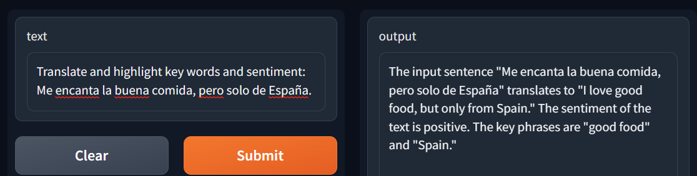

# CogAnything
CogAnything is a powerful AI agent that leverages a mixture of Azure Cognitive Services along with Azure's OpenAI architecture to provide reliable and accurate answers to a wide range of questions. It is capable of using various tools and services such as Entity Recognition, Language Detection, Key Phrase Extraction, Sentiment Analysis, and Text Translation to generate intelligent responses.

Most of this was done on the Train, and so it is not completely perfect, but is an amazing Proof of Concept. 

## Examples
The provided images demonstrate the thought process of the agent and its implementation in Gradio:

 `example_image.png` showcases the how to interacting with the agent.

 `example_chain.png` showcases the thinking behind the agent and how it iterates through different tools to come up with a final answer.

The agent can intelligently choose which Azure Cognitive Service to use, depending on the input question, to provide accurate and relevant responses.

## Installation
To use CogAnything, you will need to install the following dependencies:

```python
pip install langchain==0.0.135 pydantic requests gradio azure-ai-textanalytics==5.2.0 openai
```

## Setup

Ensure you have your API keys and required information for the following services:

- OpenAI API
- Azure Cognitive Services
- Azure Translate

Update the following lines in the code with the appropriate API keys and information:

```python
os.environ["OPENAI_API_KEY"] = ""
# ENDPOINT IN AZURE
os.environ["OPENAI_API_BASE"] = "https://cog-<>.openai.azure.com/"
# MODEL NAME
os.environ["OPENAI_API_VERSION"] = "gpt-35-turbo"
#AZURE
os.environ["OPENAI_API_TYPE"] = "azure"

#OPENAI API KEY AGAIN
API_KEY = ""
#DEPLOYMENT NAME IN AZURE
DEPLOYMENT_NAME = ""

## CogServices

#ENDPOINT
subscription_key = ""
endpoint = "https://<>.cognitiveservices.azure.com/"

## Translate
subscription_key_translate = ""
region = ""
```
## Usage
The agent runs using a pre-prompt template to guide the thought and action process. The format for the input is as follows:
```python
Question: the input question you must answer
Thought: you should always think about what to do
Action: the action to take, should be one of the tools.
Action Input: the input to the action
Observation: the result of the action
Thought: you should always think about what to do next. Use the Observation to gather extra information, but never use information outside of the Observation.
Action: the action to take, should be one of the tools.
Action_input: the input to the action
Observation: the result of the action
... (this Thought/Action/Action Input/Observation can repeat N times)
Thought: I now know the final answer.
Final Answer: the final answer to the original input question. Do not give a question after.
```

## Gradio
You can use the Gradio interface to interact with the agent by running the following code:
```python
demo = gr.Interface(fn=start, inputs=gr.Textbox(lines=2, placeholder="Ask me Anything!"), outputs=gr.Textbox(lines=2))
demo.launch()
```

## Contributions
Feel free to contribute to this project by submitting pull requests, reporting bugs, or suggesting new features. Your feedback is much appreciated!
